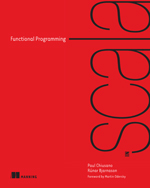

# Functional Programming in Scala

[](https://opensource.org/licenses/Apache-2.0)
[](https://travis-ci.org/CarloMicieli/fpinscala)
[](https://coveralls.io/github/CarloMicieli/fpinscala?branch=master)

Examples and exercises from



    Functional Programming in Scala
    Paul Chiusano and Rúnar Bjarnason
    (2014) Manning Publications
    http://www.manning.com/bjarnason/

## How to run

```
$ git clone https://github.com/CarloMicieli/fpinscala
$ sbt test
```

## My student guide

1. What is functional programming?
2. Getting started with functional programming in Scala
    * Hughes, John. "Why functional programming matters." _The computer journal_ 32.2 (1989): 98-107.
    * Braithwaite, Reginald. Why Why Functional Programming Matters Matters (blog). 2007. Retrieved from [here](http://raganwald.com/2014/12/20/why-why-functional-programming-matters-matters.html).
3. Functional data structures
4. Handling errors without exceptions
    * [Adelbert Chang, How do I error handle thee?, 2014](http://typelevel.org/blog/2014/02/21/error-handling.html)
    * [Daniel Westheide, The Neophyte's Guide to Scala Part 5: The Option Type, 2012](http://danielwestheide.com/blog/2012/12/19/the-neophytes-guide-to-scala-part-5-the-option-type.html)
    * [Daniel Westheide, The Neophyte's Guide to Scala Part 6: Error Handling With Try, 2012](http://danielwestheide.com/blog/2012/12/26/the-neophytes-guide-to-scala-part-6-error-handling-with-try.html)
    * [Daniel Westheide, The Neophyte's Guide to Scala Part 7: The Either Type, 2012](http://danielwestheide.com/blog/2013/01/02/the-neophytes-guide-to-scala-part-7-the-either-type.html)

5. Strictness and laziness
    * [Haskell/Laziness (WikiBook)](http://en.wikibooks.org/wiki/Haskell/Laziness)
    * [Heinrich Apfelmus, The Incomplete Guide to Lazy Evaluation (in Haskell), 2015](https://hackhands.com/guide-lazy-evaluation-haskell/)
    * [Alp Mestanogullari, Oh my laziness!, 2013](http://alpmestan.com/posts/2013-10-02-oh-my-laziness.html)
    * [Matt Might, Understand and implement laziness with examples in Scala, JavaScript, Swift and Racket](http://matt.might.net/articles/implementing-laziness/)

6. Purely functional state
7. Purely functional parallelism
8. Property-based testing
    * Claessen, Koen, and Hughes, John. "QuickCheck: a lightweight tool for random testing of Haskell programs." Acm sigplan notices 46.4 (2011): 53-64.
    * Hughes, John. "QuickCheck testing for fun and profit." Practical Aspects of Declarative Languages. Springer Berlin Heidelberg, 2007. 1-32.

9. Parser combinators
    * Hutton, G. (2016). Programming in Haskell. Cambridge University Press.
    * Hutton, Graham, and Erik Meijer. "Monadic parser combinators." (1996).
10. Monoids
11. Monads
12. Applicative and traversable functors
13. External effects and I/O
14. Local effects and mutable state
15. Stream processing and incremental I/O


## Contribution policy ##

Contributions via GitHub pull requests are gladly accepted from their original author. Along with any pull requests, please state that the contribution is your original work and that you license the work to the project under the project's open source license. Whether or not you state this explicitly, by submitting any copyrighted material via pull request, email, or other means you agree to license the material under the project's open source license and warrant that you have the legal authority to do so.

## License ##

This code is open source software licensed under the [Apache 2.0 License]("http://www.apache.org/licenses/LICENSE-2.0.html").

